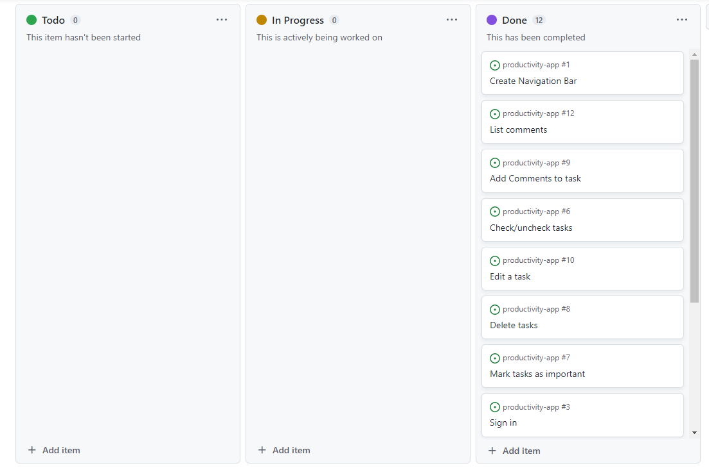
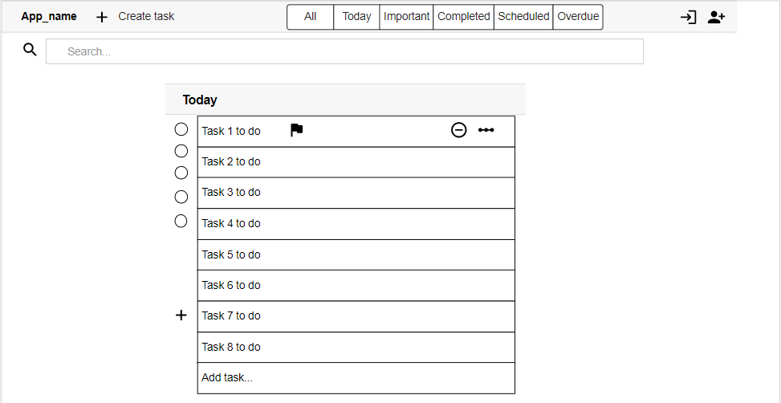

# PRODUCTIVITY-APP

The idea of Productivity App is to keep as simple as posible all your tasks listed and organised.

It is basically a simple task list app where the users are able to create, edit, delete and list all the tasks that must be done to complete the day in a good way.

Users can sign up and log in, so that they can keep their tasks private and only access them by logging into the application.

In addition, users can add comments to each task that will be saved with the corresponding date, so that they can track the process of each one.

As main goals of this project:
Understand the React architecture, the reuse of the components and the differents hooks that facilitate when developing. The use of the Router to navigate to differents path within the app. And how to interact in an organised and secure way with the backend API.

### Live Site and Repository Links

- Frontend:
    - Deployed link: [Productivity App ](https://react-productivity-app.herokuapp.com/)
    - Github repository: [Frontend Productivity App Repo](https://github.com/julamifra/productivity-app)

- Backend:
    - Deployed link: [API Productivity App](https://drf-productivity-app.herokuapp.com/)
    - Github repository: [Backend Productivity App Repo](https://github.com/julamifra/drf-productivity-app)

# Table of Contents

- [Agile Workflow](#agile-workflow)
    - [User Stories](#user-stories)
    - [Agile Methodology](#agile-methodology)
- [Features](#features)
- [Future features](#future-features)
- [Design](#design)
    - [Wireframes](#wireframes)
    - [Typography and color scheme](#typography-and-color-scheme)
    - [Components](#components)
    - [API](#api)
    - [Database](#database)
- [Technologies](#technologies)
- [Testing](#testing)
- [Deployment](#deployment)
- [Credits](#credits)

## Agile Workflow

In this project, I've used an agile methodology in order to organize and prioritize the development tasks. Some User Stories have been created on the Github dashboard.

### User Stories

Here are presented all the User Stories created for this project and should be done in order to have all the requirements:

1) Navigation bar: As an user I can see a navigation bar so that I can navigate through the different pages in the app.
2) Sign up: As an user I can sign up in the app so that I can have an account in order to keep save all my created tasks. 
3) Sign in: As an user I can sign in in the app with an account I've previously created so that I can access to all my saved tasks. 
4) Sign out: As an user I can log out from the app so that I go out from the app and keed my tasks saved there.
5) Task list: As an user I can see a task list in the home page once I am logged in. 
6) Mark/unmark tasks as done: As an user I can mark on unmark any task as done so that I can know which ones I have finished. 
7) Mark/unmark tasks as important: As an user I can mark/unmark any task as important by clicking on a flag icon so that I can prioritize my tasks 
8) Delete tasks: As an user I can delete a task by clicking on a bin icon so that I don't see the task any more on the list. 
9) Add comments: As an user I can create comments in my tasks by clicking on the edit button so that I can add extra comments to each of them. 
10) List comments: As an user I can see the comments listed in my tasks by clicking on the edit button so that I can see the process I've previously saved in each of them. 

### Agile Methodology

These user stories are created on GitHub as issues and they have been assigned to a Product Backlog project (milestone in Github). A board has been created as well to see the progress of them. This includes three columns: To Do, In progress and Done, to follow the Agile Methodology.

- Project github issues can be found here: [Github issues](https://github.com/julamifra/productivity-app/issues).

## Features

- __Navigation Bar__

    - On the left, a logo. On the right, the different tabs to navigate to the different pages of the app: Home, SignIn and SignUp
    - Once the user is signed in, a creation-task button will be displayed on the left.

- __Home__

    - This page can be accessed by clicking on the home button. All the tasks are listed in here.

- __Sign In__

    - In this page, a form is displayed, where users will be able to sign in if they have been registered previously.

- __Sign Up__

    - From here, users will be able to sign up on the application. Once they have they user created and after loging into the app, they will be able to create new tasks.

- __Creation task Form__

    - In order to access here, users must be logged in. Once in the app, a creation button will be displayed on the navigation bar and by clicking on it, a form will be shown. From here, users will be able to create new tasks for the lists.

## Design

### Wireframes

### Typography and color scheme

### Database

### Components

## Future features

- A lot of functionalities can be done to improve the app: a search functionality, add categories to the tasks, add tags to the tasks, share tasks, ...

## Technologies

- [Moqups](https://app.moqups.com/) - Use to create wireframes of the site
- GitPod: this tool has been chosen as the IDE of this project. It is a cloud development environment accessible via a browser, that can be run directly from the github repository.
- [Github](https://github.com/) - Used to host the project.
- [Heroku](https://www.heroku.com/) - It is a cloud platform as a service supporting several programming languages
- [React Bootstrap](https://react-bootstrap.github.io/) - React Library, based on Boostrap. Easy to use, with good documentation.
- [React](https://reactjs.org/) - JavaScript framework, used for all the UI.

## Testing

- After the deployment there have been some issues in terms of some of the user stories discussed above. Some CORS issues and some problems with JWT library. In terms of the second one, this JWT was not being decrypted correctly and therefore the frontend could not deal with the user's session. It turned out to be something about the libraries in the Django Project (backend). I will comment more about this on that project.

- In terms of the CORS issue, it was resolved by modifying the Config Vars. 

## Deployment

[Link to deployed site in production](https://react-productivity-app.herokuapp.com/)

- First, create a new project on Heroku. Just for the frontend part.
- Within Heroku, on the dasboard, click New and then Create a new app.
- Here we have to give a name to the project and choose our region (Europe)
- Then we have to link this with the Github repository. We have to go to the settings tab and do it from there.
- Once this project is deployed, in this case, no Config Vars are needed.
- But we have to copy the production url that Heroku generates and paste it in the Config Vars ("CLIENT_ORIGIN") of the backend deployment (I will talk about this in the other project).

## Credits

I like to thank my tutor, Rohit, for all the recommendations he has given me. 
