# PRODUCTIVITY-APP

The idea of Productivity App is to keep as simple as posible all your tasks listed and organised.

It is basically a simple task list app where the users are able to create, edit, delete and list all the tasks that must be done to complete the day in a good way.

Users can sign up and log in, so that they can keep their tasks private and only access them by logging into the application.

In addition, users can add comments to each task that will be saved with the corresponding date, so that they can track the process of each one.

As main goals of this project:
Understand the React architecture, the reuse of the components and the differents hooks that facilitate when developing. The use of the Router to navigate to differents path within the app. And how to interact in an organised and secure way with the backend API.

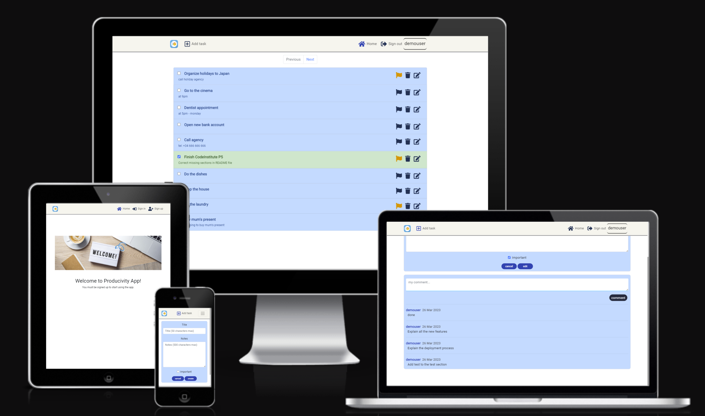

### Live Site and Repository Links

- Frontend:
    - Deployed link: [Productivity App ](https://react-productivity-app.herokuapp.com/)
    - Github repository: [Frontend Productivity App Repo](https://github.com/julamifra/productivity-app)

- Backend:
    - Deployed link: [API Productivity App](https://drf-productivity-app.herokuapp.com/)
    - Github repository: [Backend Productivity App Repo](https://github.com/julamifra/drf-productivity-app)

# Table of Contents

- [Agile Workflow](#agile-workflow)
    - [User Stories](#user-stories)
    - [Agile Methodology](#agile-methodology)
- [Features](#features)
    - [Navigation Bar](#navigation-bar)
    - [Welcome Page](#welcome-page)
    - [Edit task Form Page](#edit-task-page)
    - [Sign Up Page](#sign-up-page)
    - [Sign In Page](#sign-in-page)
    - [Tasks Page](#tasks-page)
    - [Create task Form Page](#create-task-form-page)
    - [Edit task Form Page](#edit-task-form-page)
- [Future features](#future-features)
- [Design](#design)
    - [Wireframe](#wireframe)
    - [Typography and color scheme](#typography-and-color-scheme)
    - [Components](#components)
    - [API](#api)
    - [Database](#database)
- [Technologies](#technologies)
- [Testing](#testing)
- [Deployment](#deployment)
- [Credits](#credits)

## Agile Workflow

In this project, I've used an agile methodology in order to organize and prioritize the development tasks. Some User Stories have been created on the Github dashboard.

### User Stories

Here are presented all the User Stories created for this project and should be done in order to have all the requirements:

1) Navigation bar: As an user I can see a navigation bar so that I can navigate through the different pages in the app.
2) Sign up: As an user I can sign up in the app so that I can have an account in order to keep save all my created tasks. 
3) Sign in: As an user I can sign in in the app with an account I've previously created so that I can access to all my saved tasks. 
4) Sign out: As an user I can log out from the app so that I go out from the app and keed my tasks saved there.
5) Task list: As an user I can see a task list in the home page once I am logged in. 
6) Mark/unmark tasks as done: As an user I can mark on unmark any task as done so that I can know which ones I have finished. 
7) Mark/unmark tasks as important: As an user I can mark/unmark any task as important by clicking on a flag icon so that I can prioritize my tasks 
8) Delete tasks: As an user I can delete a task by clicking on a bin icon so that I don't see the task any more on the list. 
9) Add comments: As an user I can create comments in my tasks by clicking on the edit button so that I can add extra comments to each of them. 
10) List comments: As an user I can see the comments listed in my tasks by clicking on the edit button so that I can see the process I've previously saved in each of them. 

### Agile Methodology

These user stories are created on GitHub as issues and they have been assigned to a Product Backlog project (milestone in Github). A board has been created as well to see the progress of them. This includes three columns: To Do, In progress and Done, to follow the Agile Methodology.

- Project github issues can be found here: [Github issues](https://github.com/julamifra/productivity-app/issues).

## Features

In this section, the different pages and features will be presented and explained, giving a full understanding of how the application works.

### __Navigation Bar__

On the left of the bar, the logo will be always display. On the right, the different buttons to navigate through the application

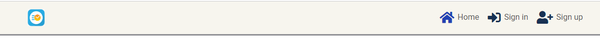

    - When the user hasn't logged in yet, the navigation bar will be as it's shown above. On the left, the logo of the application is displayed. On the right, the 3 different buttons: the Home, the SignIn and the SignUp buttons. Each of them will redirect the user to the corresponding page.

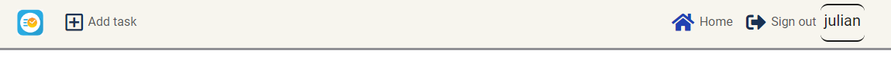

    - Once the user is logged in, the navigation bar will be like it's shown in this second image. An Add Task button will be shown just beside the icon on the left. Then, on the right side, the Sign In button will be replaced by Sign Out button, and the Sign Up by the name of user is logged in.

### __Welcome Page__

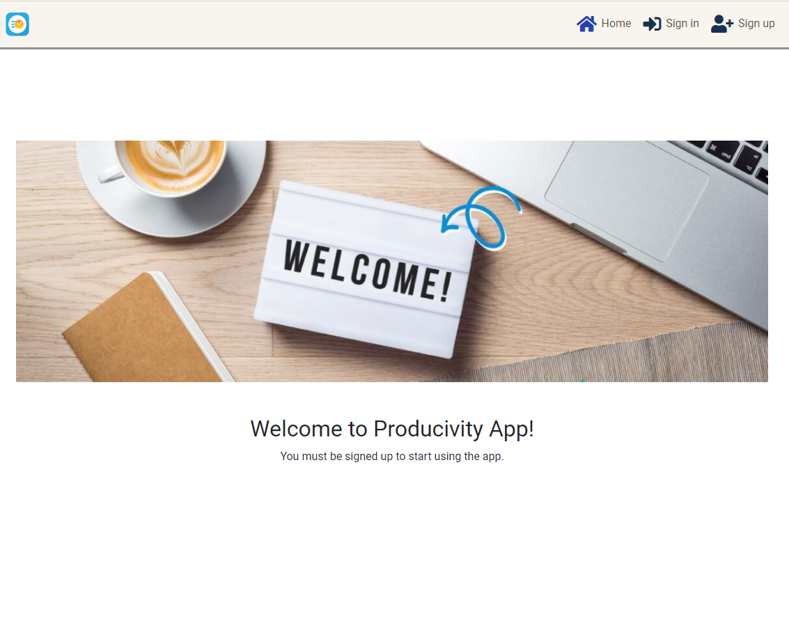
 
    - This is the first page is shown up when navigating to the website. Just a Welcome image and a message, encouraging the user to register.

### __Sign Up Page__

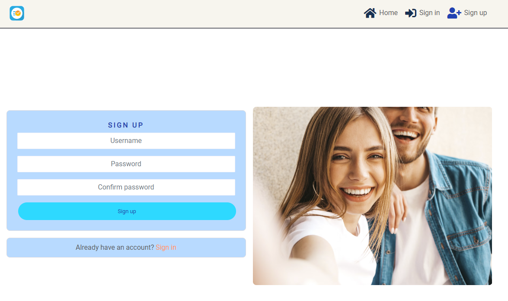

    - From here, users will be able to sign up on the application. This page can be accessed by clicking on the Sign Up button in the navigation bar, when the user is not logged in yet.
    - To create an account, users will need to enter a username and a password. The password must contain at least 8 characters

### __Sign In Page__

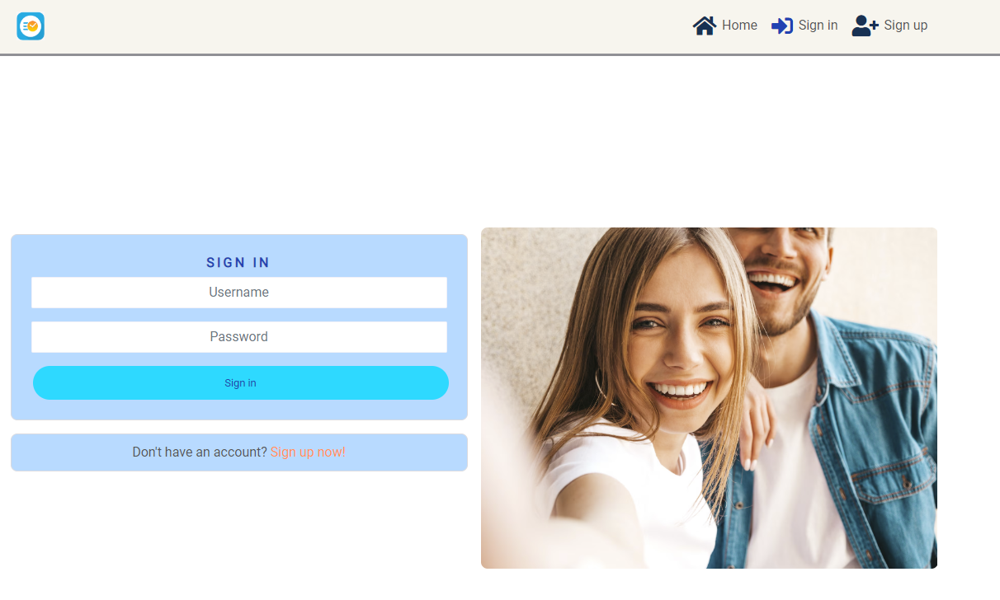

    - From this page, users will be able to sign into the application. This page can be accessed by clicking on the Sign In button in the navigation bar, when the user is not logged in yet.
    - In here, a form is displayed, where users will be able to sign in if they have been registered previously.

### __Tasks Page__

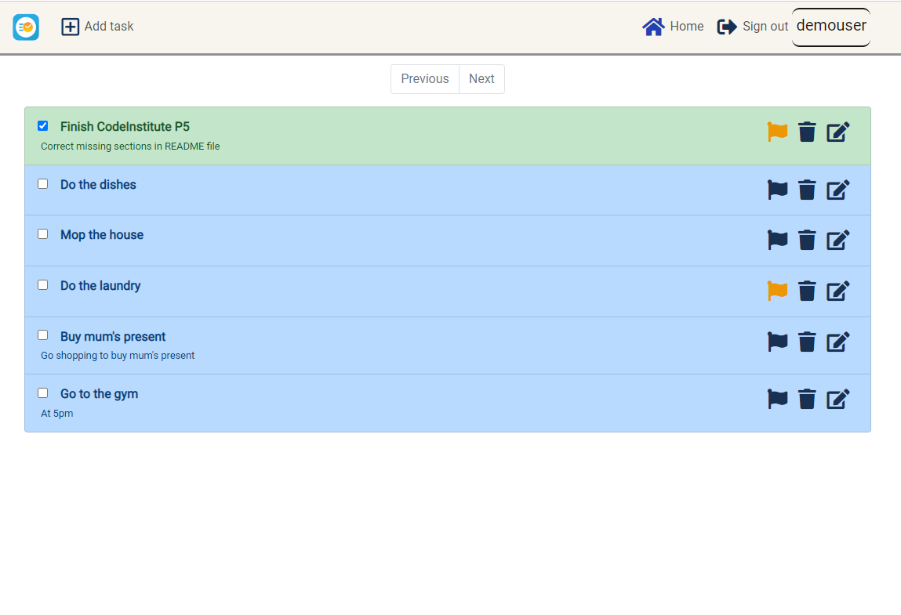

    - The first time users enter the application this home page is shown. This page is also accessed by clicking on the home button on the nav bar, when the user is already logged in. All the tasks that the corresponding user has created previously will be listed in this page.

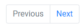

    - If there are more than 10 task on the list, these buttons will be enabled, where users will be able to navigate through all the created tasks by clicking on the Next and Previous buttons just on the very top of the list.
    - If there are 10 or less tasks on the list, these buttons will be disabled.

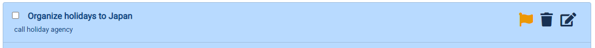

    - Each task is presented as one row in the list and it contains the following:
        - A checkbox to marck/unmark the task if it's already done. It will be change to green when it's checked.
        - The title of the task.
        - Some notes (if written) just above the title.
        - Three buttons to the right of the row: to mark/unmarked as important, to remove the task or to edit the task.
    - If users marked a task as important by clicking on the flag icon, this icon will turn into yellow.
    - If users click on the bin icon, the task will be deleted and the page will be refreshed.
    - If users click on the edit button, they will be redirected to the Edit Task Form Page (explained below).

### __Create task Form Page__

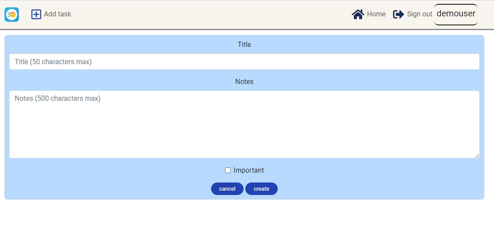

    - In order to access here, users must be logged in. Once in the app, a creation button will be displayed on the navigation bar and by clicking on it, a form will be shown. From here, users will be able to create new tasks.
    - To create a task users must write the title of the task. Notes and Important fields are not required in this form. Important field will be false by default.
    - By clicking on Cancel button, users will be redirected to the home page.

### __Edit task Form Page__

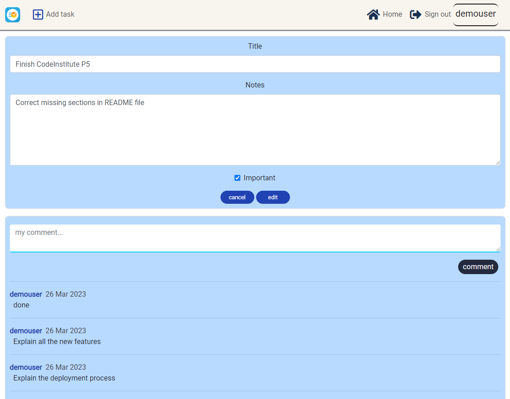

    - This page will be displayed if users want to edit a task. To do that, users must click on the Edit button from thre corresponding task.
    - In here, each fields of the task (Title, Notes and Important) can be edited and saved by clicking on the Edit button.
    - In addition, a new feature is presented here: the Comments section. In here, users can add any comment to the corresponding task, to follow the process of it in more detailed. 
    - Just by typping anything they want on the Comment box and clicking on the Comment button, the comment will be added.
    - Then, the comment list will be displayed just below, sorted by the creation date.

## Design

### Wireframe

This is the mockup followed before starting to develop the frontend project.

### Typography and color scheme

### Database

### Components

## Future features

- A lot of functionalities can be done to improve the app: a search functionality, add categories to the tasks, add tags to the tasks, share tasks, ...

- search bar
- edit and remove comments

## Technologies

- [Moqups](https://app.moqups.com/) - Use to create wireframes of the site
- GitPod: this tool has been chosen as the IDE of this project. It is a cloud development environment accessible via a browser, that can be run directly from the github repository.
- [Github](https://github.com/) - Used to host the project.
- [Heroku](https://www.heroku.com/) - It is a cloud platform as a service supporting several programming languages
- [React Bootstrap](https://react-bootstrap.github.io/) - React Library, based on Boostrap. Easy to use, with good documentation.
- [React](https://reactjs.org/) - JavaScript framework, used for all the UI.

## Testing

- After the deployment there have been some issues in terms of some of the user stories discussed above. Some CORS issues and some problems with JWT library. In terms of the second one, this JWT was not being decrypted correctly and therefore the frontend could not deal with the user's session. It turned out to be something about the libraries in the Django Project (backend). I will comment more about this on that project.

- In terms of the CORS issue, it was resolved by modifying the Config Vars. 

## Deployment

[Link to deployed site in production](https://react-productivity-app.herokuapp.com/)

- First, create a new project on Heroku. Just for the frontend part.
- Within Heroku, on the dasboard, click New and then Create a new app.
- Here we have to give a name to the project and choose our region (Europe)
- Then we have to link this with the Github repository. We have to go to the settings tab and do it from there.
- Once this project is deployed, in this case, no Config Vars are needed.
- But we have to copy the production url that Heroku generates and paste it in the Config Vars ("CLIENT_ORIGIN") of the backend deployment (I will talk about this in the other project).

## Credits

I like to thank my tutor, Rohit, for all the recommendations he has given me. 
