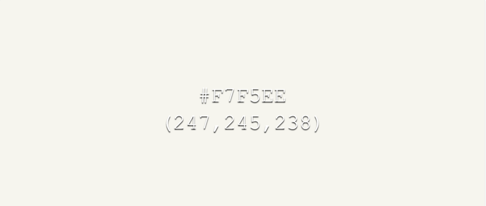
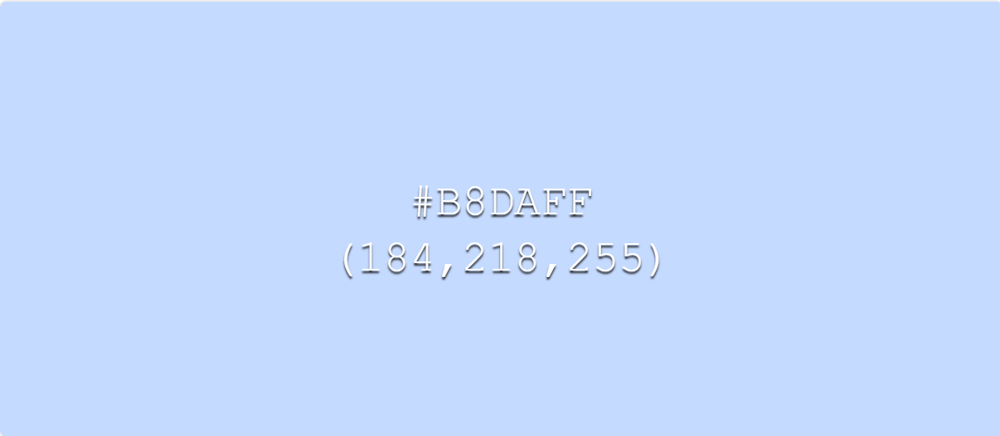
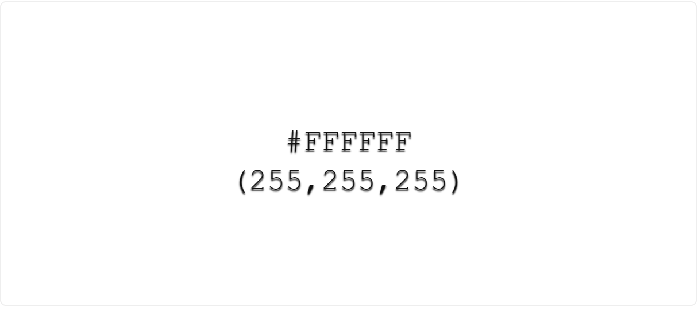
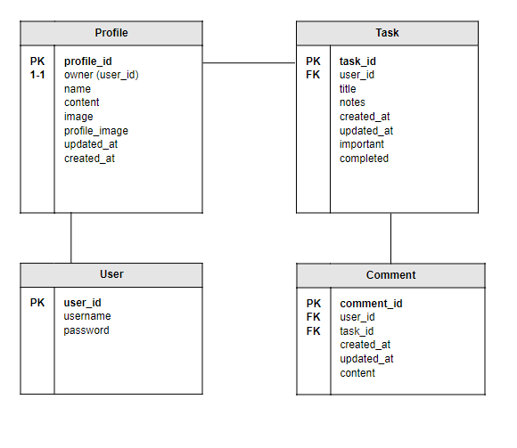
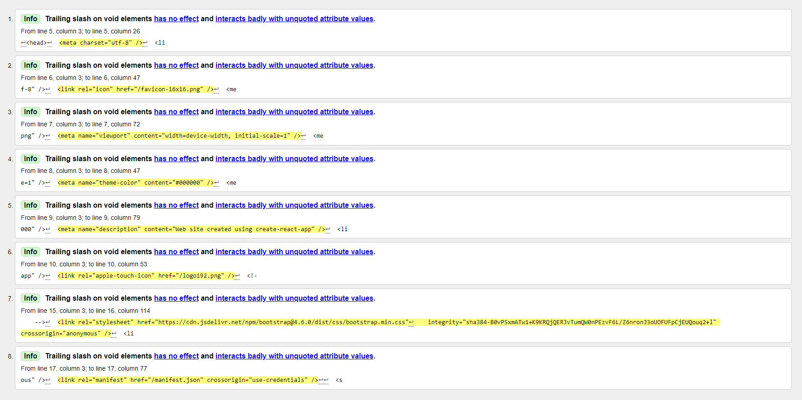
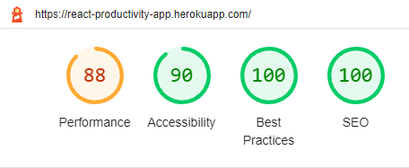
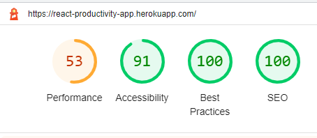
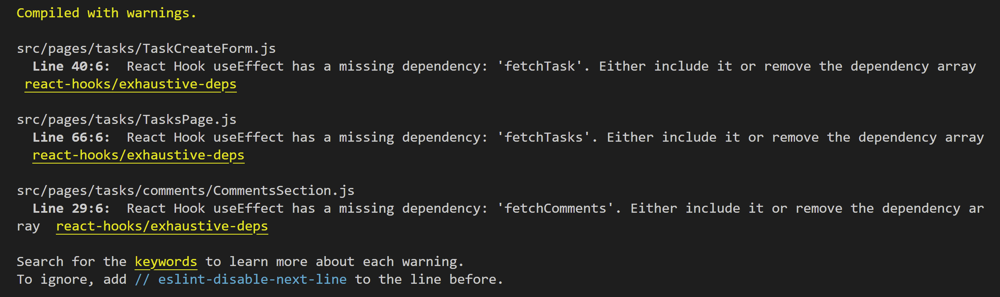

# PRODUCTIVITY-APP

The idea of Productivity App is to keep as simple as posible all your tasks listed and organised.

It is basically a simple task list app where the users are able to create, edit, delete and list all the tasks that must be done to complete the day in a good way.

Users can sign up and log in, so that they can keep their tasks private and only access them by logging into the application.

In addition, users can add comments to each task that will be saved with the corresponding date, so that they can track the process of each one.

As main goals of this project:
Understand the React architecture, the reuse of the components and the differents hooks that facilitate when developing. The use of the Router to navigate to differents path within the app. And how to interact in an organised and secure way with the backend API.

### Live Site and Repository Links

- Frontend:
    - Deployed link: [Productivity App ](https://react-productivity-app.herokuapp.com/)
    - Github repository: [Frontend Productivity App Repo](https://github.com/julamifra/productivity-app)

- Backend:
    - Deployed link: [API Productivity App](https://drf-productivity-app.herokuapp.com/)
    - Github repository: [Backend Productivity App Repo](https://github.com/julamifra/drf-productivity-app)

# Table of Contents

- [Agile Workflow](#agile-workflow)
    - [User Stories](#user-stories)
    - [Agile Methodology](#agile-methodology)
- [Features](#features)
    - [Navigation Bar](#navigation-bar)
    - [Welcome Page](#welcome-page)
    - [Edit task Form Page](#edit-task-page)
    - [Sign Up Page](#sign-up-page)
    - [Sign In Page](#sign-in-page)
    - [Tasks Page](#tasks-page)
    - [Create task Form Page](#create-task-form-page)
    - [Edit task Form Page](#edit-task-form-page)
- [Future features](#future-features)
- [Design](#design)
    - [Wireframe](#wireframe)
    - [Typography and color scheme](#typography-and-color-scheme)
    - [API](#api)
    - [Components](#components)
- [Technologies](#technologies)
- [Testing](#testing)
- [Deployment](#deployment)
- [Credits](#credits)

## Agile Workflow

In this project, I've used an agile methodology in order to organize and prioritize the development tasks. Some User Stories have been created on the Github dashboard.

### User Stories

Here are presented all the User Stories created for this project and should be done in order to have all the requirements:

1) Navigation bar: As an user I can see a navigation bar so that I can navigate through the different pages in the app.
2) Sign up: As an user I can sign up in the app so that I can have an account in order to keep save all my created tasks. 
3) Sign in: As an user I can sign in in the app with an account I've previously created so that I can access to all my saved tasks. 
4) Sign out: As an user I can log out from the app so that I go out from the app and keed my tasks saved there.
5) Task list: As an user I can see a task list in the home page once I am logged in. 
6) Mark/unmark tasks as done: As an user I can mark on unmark any task as done so that I can know which ones I have finished. 
7) Mark/unmark tasks as important: As an user I can mark/unmark any task as important by clicking on a flag icon so that I can prioritize my tasks 
8) Delete tasks: As an user I can delete a task by clicking on a bin icon so that I don't see the task any more on the list. 
9) Add comments: As an user I can create comments in my tasks by clicking on the edit button so that I can add extra comments to each of them. 
10) List comments: As an user I can see the comments listed in my tasks by clicking on the edit button so that I can see the process I've previously saved in each of them. 

### Agile Methodology

These user stories are created on GitHub as issues and they have been assigned to a Product Backlog project (milestone in Github). A board has been created as well to see the progress of them. This includes three columns: To Do, In progress and Done, to follow the Agile Methodology.

- Project github issues can be found here: [Github issues](https://github.com/julamifra/productivity-app/issues).

## Features

In this section, the different pages and features will be presented and explained, giving a full understanding of how the application works.

### __Navigation Bar__

On the left of the bar, the logo will be always display. On the right, the different buttons to navigate through the application

- When the user hasn't logged in yet, the navigation bar will be as it's shown above. On the left, the logo of the application is displayed. On the right, the 3 different buttons: the Home, the SignIn and the SignUp buttons. Each of them will redirect the user to the corresponding page.

- Once the user is logged in, the navigation bar will be like it's shown in this second image. An Add Task button will be shown just beside the icon on the left. Then, on the right side, the Sign In button will be replaced by Sign Out button, and the Sign Up by the name of user is logged in.

### __Welcome Page__

 
- This is the first page is shown up when navigating to the website. Just a Welcome image and a message, encouraging the user to register.

### __Sign Up Page__

- From here, users will be able to sign up on the application. This page can be accessed by clicking on the Sign Up button in the navigation bar, when the user is not logged in yet.
- To create an account, users will need to enter a username and a password. The password must contain at least 8 characters

### __Sign In Page__

- From this page, users will be able to sign into the application. This page can be accessed by clicking on the Sign In button in the navigation bar, when the user is not logged in yet.
- In here, a form is displayed, where users will be able to sign in if they have been registered previously.

### __Tasks Page__

- The first time users enter the application this home page is shown. This page is also accessed by clicking on the home button on the nav bar, when the user is already logged in. All the tasks that the corresponding user has created previously will be listed in this page.

- If there are more than 10 task on the list, these buttons will be enabled, where users will be able to navigate through all the created tasks by clicking on the Next and Previous buttons just on the very top of the list.
- If there are 10 or less tasks on the list, these buttons will be disabled.

- Each task is presented as one row in the list and it contains the following:
    - A checkbox to marck/unmark the task if it's already done. It will be change to green when it's checked.
    - The title of the task.
    - Some notes (if written) just above the title.
    - Three buttons to the right of the row: to mark/unmarked as important, to remove the task or to edit the task.
- If users marked a task as important by clicking on the flag icon, this icon will turn into yellow.
- If users click on the bin icon, the task will be deleted and the page will be refreshed.
- If users click on the edit button, they will be redirected to the Edit Task Form Page (explained below).

### __Create task Form Page__

- In order to access here, users must be logged in. Once in the app, a creation button will be displayed on the navigation bar and by clicking on it, a form will be shown. From here, users will be able to create new tasks.
- To create a task users must write the title of the task. Notes and Important fields are not required in this form. Important field will be false by default.
- By clicking on Cancel button, users will be redirected to the home page.

### __Edit task Form Page__

- This page will be displayed if users want to edit a task. To do that, users must click on the Edit button from thre corresponding task.
- In here, each fields of the task (Title, Notes and Important) can be edited and saved by clicking on the Edit button.
- In addition, a new feature is presented here: the Comments section. In here, users can add any comment to the corresponding task, to follow the process of it in more detailed. 
- Just by typping anything they want on the Comment box and clicking on the Comment button, the comment will be added.
- Then, the comment list will be displayed just below, sorted by the creation date.

## Future features

A lot of functionalities can be done to improve the app: 

- a search bar can be added to search for the task easily.
- also tasks can be categorized by tags, so that, users can have their tasks more organaised.
- edit and remove comments functionalities can be added to each task too.

## Design

### Wireframe

This is the mockup followed before starting to develop the frontend project.

### Typography and color scheme

- In terms of the typography, the one used in this project has been [Roboto](https://fonts.google.com/?query=Roboto), as it is quite simple and that's what we are looking for in here.

- Regarding the color scheme, these are the three colors that are presented the most:

Grey: 
Blue: 
White: 

A very soft color scheme has been used. The grey color is used for the navigation bar and the blue for all the boxes presented in the app: the form boxex, the comments box and the list.

### API

For the API of this project, Django framework has been used. The deployed link of this API and the repository are the following:

- Deployed link: [API Productivity App](https://drf-productivity-app.herokuapp.com/)

- Github repository: [Backend Productivity App Repo](https://github.com/julamifra/drf-productivity-app)

#### __Database__

In terms of the backend database, this is the Model has been followed. Four tables are presented. User is given by the Django framework. Profile, Task and Comment tables have been custom-made for this project.

### Components

The following components have been created for this project. Some of them are reused throughout the application:

#### Custom components

- Asset: This component is used to show different images accross the application. This component is used in the following pages and components: Navbar, SignInForm, SignUpForm and TaskPage.
- NavBar: The navigation bar component is used in all the pages as it is the component that is always presented at the top of the application.
- Comment: The comment component for example, is only used in the comment section. It is implemented to represent each comment users create in the tasks. 
- TaskCreateForm: This component is used to show the creation form when creating a task or the edit form in order to edit a task. For the first case, no props are passed, as the form is empty in the creation of the task. For the second case, some props are passed to the component in order to show the value of the fields to edit.

#### Bootstrap components

Furthermore, as I've used Bootstrap library, most of the components are taken from this library and used also withing the custom components:

- Within the custom NavBar component, Bootstrap component, such as Navbar, Container, Nav, are been used.

- Components such as Form, Button, Image, Col, Row, Container, Alert are used throughout the entire application.

- Other main important components such as Pagination or ListGroup are used in the TaskPage component.

## Technologies

- [Moqups](https://app.moqups.com/) - Use to create wireframes of the site
- GitPod: this tool has been chosen as the IDE of this project. It is a cloud development environment accessible via a browser, that can be run directly from the github repository.
- [Github](https://github.com/) - Used to host the project.
- [Heroku](https://www.heroku.com/) - It is a cloud platform as a service supporting several programming languages
- [React Bootstrap](https://react-bootstrap.github.io/) - React Library, based on Boostrap. Easy to use, with good documentation.
- [React](https://reactjs.org/) - JavaScript framework, used for all the UI.

## Testing

### W3C Markup Validator:

In terms of the html validor, no important errors were found. Only some info messages were shown.

### Lighthouse Test:

Regarding the Lighthouse testing of Chrome develeper tools, it has given the following results, for both Desktop and Mobile:

Desktop: 

Mobile:

As we can see in the results, desktop perfomance is 88%, a big difference compare to mobile performance 53%. This low result is due to two main reasons: Reduce unused JavaScript and Minify JavaScript. The recomendation in here is to reduce JS and defer loading scripts until they are required, in order to decrease bytes consumed by network activity. 
For a matter of time, this can be fixed now and it could be a improvment for the future.

### ESLint:

In terms of the ESLint, it was used for frontend code validation. Most of them were easily fixed. The final result is the following:

These warnings are due to some useEffect hooks, in which the depency array is empty. But this is valid as it is discussed in here [Empty Dependecy array - Stackoverflow](https://stackoverflow.com/questions/58579426/in-useeffect-whats-the-difference-between-providing-no-dependency-array-and-an)

### Feature tests:

- __No logged in user__
    1) A user that is not logged in, can only see the navigation bar, with icons to SignUp, SignIn or go to Home.
    2) A welcome page is shown in the Home section.
- __Sign up page__
    1) Signup form renders correctly, when clicking on the signup button in the navigation bar.
    2) The img is shown properly to the right of the page.
    3) By clicking on the Sign Up button with the correct username and password the user is redirected to the sign in page.
    4) By clicking on the Sign in link the user is redirected to this page.
- __Sign in page__
    1) The Sign in page is rendered correctly when navigating to this page.
    2) By entering the username and password the user is redirected to the Home page.
    3) By clicking on the Sign up link the user is redirected to this page.
    4) The Navigation Bar is updated correctly.
- __Home page__
    1) All tasks are rendered in the list with the title, note (if added) and 3 buttons to the right (flag, bin, edit).
    2) If task is marked, its background is green.
    3) If Flag icon is marked, its turns into yellow.
    4) If the Bin icon is clicked, the task is removed and the list is refreshed.
    5) If the Edit icon is clicked the user is redirected to the CreateForm page.
    6) Previous and Next button are displayed at the very top of the page.
    7) If there are more than 10 elements on the list, this buttons are enabled. Otherwise, there are disabled.
- __Create Task page__
    1) A form is displayed with 3 fields (title, notes and important) when clicking on the Add Task button in the navbar.
    2) If only title field is added and create a task, uer is redirected to the home page and the task is created with this title, no notes and an unmarked flag icon.
    3) Like in 2., but also adding something in the notes field and marking the important checkbox. Now, this notes input is displayed below the title and the flag is yellow, in the home page.
    4) If click on cancel, the user is redirected to the home page.
- __Edit Task page__
    1) This page is accessed by clicking on the edit icon of the corresponding task.
    2) Fields (title, notes and important) are filled with the corresponding values.
    3) By modifying any of the fields and clicking on the Edit buttons, the user is redirected to the home page with the values updated.
    4) By clicking on the Cancel button the user is redirected to the home page with the same values as before entering in the Edit Task form.
- __Comment section__
    1) Below the Edit Form, a Comment section is shown.
    2) If there is no comments, a "no comments..." message is displayed. Otherwise, all the comments are shown.
    3) Comments are shown with the name of the user, the creation date and the content of the comment.
    4) The user can add a comment by entering it on the Comment input and clicking on the Comment button.
    5) The created comment is inmediately updated on the comment list.
- __Log out__
    1) Clicking on the Sign Out button in the navbar, in any moment, the user is redirected to the welcome page.
    2) The navigation bar is rendered with the corresponding buttons: Home, Sign In and Sign Up. No add task button is displayed.

## Bugs

After the deployment there have been found some issues:

- The first main issue it was in terms of the JWT library. The JWT was not being decrypted correctly and therefore the frontend could not deal with the user's session. It turned out to be something about the libraries in the Django Project (backend), that was solved by downgrading the version of the library. 

- Another issue found was about CORS. The first solution was to modify some fields in the Config Vars section on Heroku.
The second issue regarding CORS was about the CORS Middleware (MW) order in the backend (Django) project. By moving this MW (corsheaders.middleware.CorsMiddleware) to the first element of the MW list, this issue was fixed.

## Deployment

- [Link to deployed site in production](https://react-productivity-app.herokuapp.com/)

### Frontend project

- First, create a new project on Github and open it in Gitpod by clicking on the Gitpod button.
- Then, within Gitpod, open a terminal and run the following commnad, to create a react app with the CodeInstitue template:
    `npx create-react-app . --template git+https://github.com/Code-Institute-Org/cra-template-moments.git --use-npm`
- One problem that can be encountered is with the `"engines": {"node": "16.19.0"}` dependency in the package.json. My deployment was failing due to this missing property.

- Now, on Heroku, click on New button and then Create a new app.
- Here we have to give a name to the project and choose our region (Europe)
- Then we have to link this with the Github repository we've just created. We have to go to the settings tab and do it from there.
- Once this project is deployed, in this case, no Config Vars are needed.
- But we have to copy the production url that Heroku generates and paste it in the Config Vars ("CLIENT_ORIGIN") of the backend deployment.

### Backend project (Django API)

- Links:
    - Deployed link: [API Productivity App](https://drf-productivity-app.herokuapp.com/)
    - Github repository: [Backend Productivity App Repo](https://github.com/julamifra/drf-productivity-app)

- As I said in the previous section, a new Config Variable must be added in the backend project:
    - Key: CLIENT ORIGIN - Value: 'https://react-productivity-app.herokuapp.com'
    - Make sure the slash (/) is not at the end of the URL.
- After making this change, re-deploy the API project again on Heroku.

## Credits

I like to thank my tutor, Rohit, for all the recommendations he has given me. 
